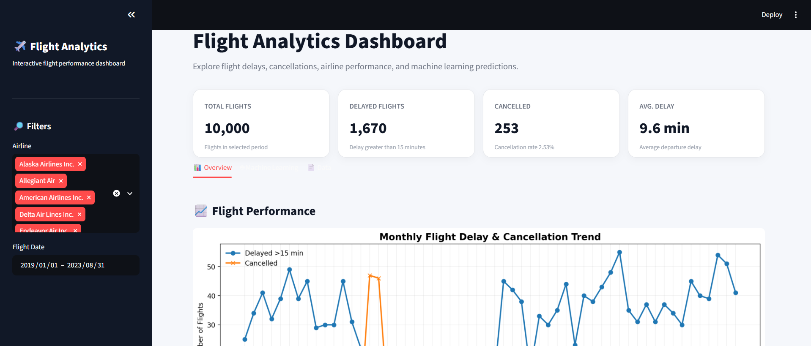
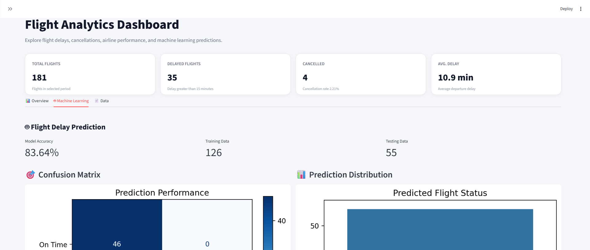
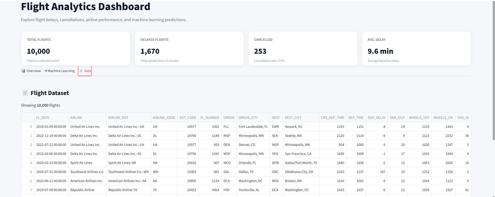

# ✈️ Flight Analytics Dashboard

Interactive **Flight Analytics Dashboard** built with **Python, Streamlit, Pandas, Matplotlib, Seaborn, and Scikit-learn**.

Project ini digunakan untuk menganalisis performa penerbangan, mengidentifikasi pola keterlambatan dan pembatalan penerbangan, serta memprediksi keterlambatan penerbangan menggunakan algoritma **Random Forest Classifier**.

---

## 📊 Dashboard Preview

### Flight Analytics Dashboard



### Machine Learning



### Data



---

## 🚀 Features

### 📊 Flight Performance Overview

Menampilkan analisis performa penerbangan secara interaktif, meliputi:

* Total flights
* Delayed flights
* Cancelled flights
* Average departure delay
* Monthly delay & cancellation trends
* Delay causes
* Airline performance

Filter yang tersedia:

* ✈️ Airline
* 📅 Flight Date

### 🤖 Machine Learning

Model machine learning digunakan untuk memprediksi apakah penerbangan mengalami keterlambatan lebih dari **15 menit**.

**Model:** Random Forest Classifier

**Features:**

* `AIRLINE`
* `ORIGIN`
* `DEST`
* `DAY_OF_WEEK`
* `MONTH`

**Target:**

```text
DEP_DELAY > 15 minutes
```

Preprocessing menggunakan:

* `OneHotEncoder` untuk fitur kategorikal
* `SimpleImputer` untuk fitur numerik

Evaluasi model meliputi:

* Accuracy
* Confusion Matrix
* Prediction Distribution
* Feature Importance
* Classification Report

### 📄 Flight Dataset

Menampilkan dataset penerbangan secara interaktif berdasarkan filter yang dipilih.

---

## 🛠️ Tech Stack

| Technology   | Purpose                   |
| ------------ | ------------------------- |
| Python       | Programming language      |
| Streamlit    | Interactive dashboard     |
| Pandas       | Data manipulation         |
| NumPy        | Numerical computation     |
| Matplotlib   | Data visualization        |
| Seaborn      | Statistical visualization |
| Scikit-learn | Machine learning          |

---

## 💻 Installation

### 1. Clone Repository

```bash
git clone https://github.com/USERNAME/flight-analytics.git
cd flight-analytics
```

### 2. Create Virtual Environment

**Windows:**

```bash
python -m venv venv
venv\Scripts\activate
```

**Linux / macOS:**

```bash
python3 -m venv venv
source venv/bin/activate
```

### 3. Install Dependencies

```bash
pip install -r requirements.txt
```

Jika belum memiliki `requirements.txt`, gunakan:

```text
streamlit
pandas
numpy
matplotlib
seaborn
scikit-learn
```

---

## ▶️ Run the Application

```bash
streamlit run app.py
```

Aplikasi dapat diakses melalui:

```text
http://localhost:8501
```

---

## 📂 Dataset

Project ini menggunakan dataset penerbangan dalam format CSV.

Dataset diharapkan berada di:

```text
data/flights_sample_10000.csv
```

### Dataset Columns

| Column                    | Description                    |
| ------------------------- | ------------------------------ |
| `FL_DATE`                 | Flight date                    |
| `AIRLINE`                 | Airline code                   |
| `ORIGIN`                  | Origin airport                 |
| `DEST`                    | Destination airport            |
| `DEP_DELAY`               | Departure delay                |
| `CANCELLED`               | Cancellation status            |
| `DELAY_DUE_CARRIER`       | Carrier-related delay          |
| `DELAY_DUE_WEATHER`       | Weather-related delay          |
| `DELAY_DUE_NAS`           | National Airspace System delay |
| `DELAY_DUE_SECURITY`      | Security-related delay         |
| `DELAY_DUE_LATE_AIRCRAFT` | Late aircraft delay            |

---

## 🧠 Machine Learning Workflow

```text
Flight Dataset
      │
      ▼
Data Filtering
      │
      ▼
Feature Engineering
      │
      ├── DAY_OF_WEEK
      └── MONTH
      │
      ▼
Train / Test Split
      │
      ├── 70% Training
      └── 30% Testing
      │
      ▼
Preprocessing
      │
      ├── OneHotEncoder
      └── SimpleImputer
      │
      ▼
Random Forest Classifier
      │
      ▼
Prediction
      │
      ▼
Model Evaluation
      │
      ├── Accuracy
      ├── Confusion Matrix
      ├── Feature Importance
      └── Classification Report
```

### Model Configuration

```python
RandomForestClassifier(
    random_state=42,
    n_estimators=100
)
```

---

## 🎯 Dashboard KPI

Dashboard menampilkan empat KPI utama:

* **Total Flights** — jumlah penerbangan
* **Delayed Flights** — penerbangan dengan delay >15 menit
* **Cancelled** — jumlah penerbangan yang dibatalkan
* **Average Delay** — rata-rata departure delay

---

## 📊 Visualizations

### Monthly Flight Trend

Menampilkan tren **delayed flights** dan **cancelled flights** berdasarkan bulan.

### Delay Causes

Menganalisis total waktu keterlambatan berdasarkan:

* Carrier
* Weather
* NAS
* Security
* Late Aircraft

### Airline Performance

Membandingkan rata-rata departure delay antar maskapai.

### Confusion Matrix

Menampilkan performa prediksi model antara penerbangan **On Time** dan **Delayed**.

### Feature Importance

Menampilkan **15 fitur teratas** yang paling berpengaruh terhadap prediksi keterlambatan penerbangan.
